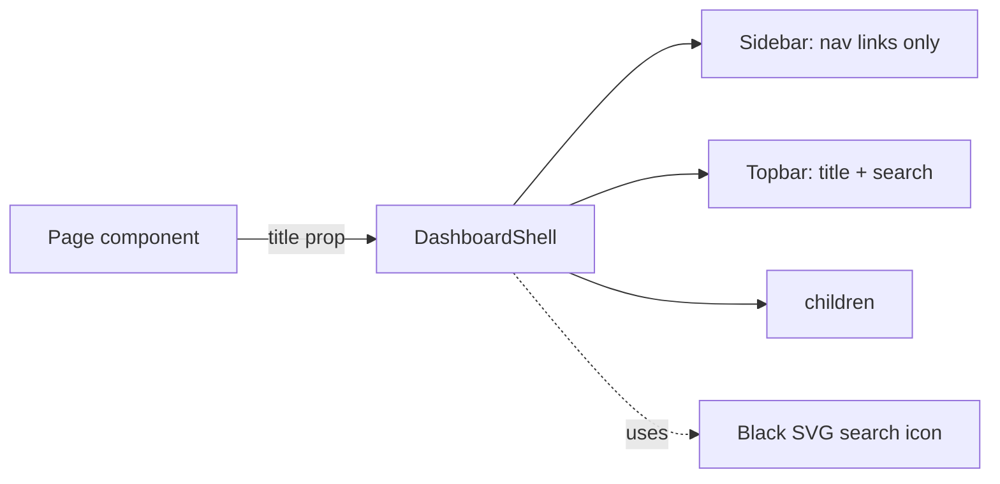

## Plan: Dashboard cleanup

Strip emoji icons, white background, dynamic topbar title, and remove static text/data.

**Steps**

1. **Update `client/src/components/DashboardShell.jsx`** (depends on nothing):
   - Remove all emoji icons from `userNav` and `adminNav` (delete the `icon` field) and from the `Contact us` block in the sidebar.
   - Change shell background from default to `bg-white` (already white, but add a `bg-white` to the root wrapper for explicitness).
   - Make `title` a required prop; render it in the topbar; remove the hardcoded "Admin Console" / "Home" logic and the `isAdmin` title branch.
   - Replace the 🔍 span with an inline black SVG search icon.
   - Remove "Book Now" button from the topbar.
   - Remove the user name/role/logout pill from the topbar (clean look).
   - Remove the "2026 All rights reserved" footer text.

2. **Update every page that uses `DashboardShell`** to pass `title="…"` (parallel with step 1):
   - `client/src/pages/user/UserHome.jsx` → `title="Home"`
   - `client/src/pages/user/Packages.jsx` → `title="Packages"`
   - `client/src/pages/user/BookPackage.jsx` → `title="Book Package"`
   - `client/src/pages/user/MyBookings.jsx` → `title="My Bookings"`
   - `client/src/pages/admin/AdminHome.jsx` → `title="Admin Console"`
   - `client/src/pages/admin/ManagePackages.jsx` → `title="Manage Packages"`
   - `client/src/pages/admin/ManageBookings.jsx` → `title="Manage Bookings"`
   - `client/src/pages/admin/ManagePortfolio.jsx` → `title="Manage Portfolio"`
   - `client/src/pages/admin/ManageBlogs.jsx` → `title="Manage Blogs"`
   - `client/src/pages/admin/ManageContact.jsx` → `title="Contact Inbox"`
   - `client/src/pages/admin/ManageTestimonials.jsx` → `title="Testimonials"`
   - `client/src/pages/admin/ManageUsers.jsx` → `title="Manage Users"`

3. **Remove static text from public pages** (depends on step 1):
   - `client/src/pages/Home.jsx` — clear the hardcoded hero copy, keep only dynamic sections driven by API (testimonials, packages, portfolio) and the API fetch.
   - `client/src/pages/user/SimplePage.jsx` — replace the static `<h1>` body with an empty container; the page is only used for the "Services / About / Contact" stubs.

4. **Verify**:
   - `npm run build` in `client/` succeeds.
   - Visiting `/`, `/dashboard`, `/admin/*` shows a clean white topbar with only the search icon and the dynamic title.
   - No emoji remains in `DashboardShell` (`grep` for emoji hex ranges).

**Relevant files**
- `client/src/components/DashboardShell.jsx` — strip icons, accept `title` prop, replace 🔍 with black SVG, white background.
- `client/src/pages/user/UserHome.jsx` — pass `title="Home"`.
- `client/src/pages/user/Packages.jsx` — pass `title="Packages"`.
- `client/src/pages/user/BookPackage.jsx` — pass `title="Book Package"`.
- `client/src/pages/user/MyBookings.jsx` — pass `title="My Bookings"`.
- `client/src/pages/admin/AdminHome.jsx` — pass `title="Admin Console"`.
- `client/src/pages/admin/ManagePackages.jsx` — pass `title="Manage Packages"`.
- `client/src/pages/admin/ManageBookings.jsx` — pass `title="Manage Bookings"`.
- `client/src/pages/admin/ManagePortfolio.jsx` — pass `title="Manage Portfolio"`.
- `client/src/pages/admin/ManageBlogs.jsx` — pass `title="Manage Blogs"`.
- `client/src/pages/admin/ManageContact.jsx` — pass `title="Contact Inbox"`.
- `client/src/pages/admin/ManageTestimonials.jsx` — pass `title="Testimonials"`.
- `client/src/pages/admin/ManageUsers.jsx` — pass `title="Manage Users"`.
- `client/src/pages/Home.jsx` — remove hardcoded hero copy.
- `client/src/pages/user/SimplePage.jsx` — clear static body.

**Diagrams**

**Verification**
1. `cd client && npm run build` — no errors.
2. `grep -P "[\x{1F300}-\x{1FAFF}\x{2600}-\x{27BF}]" client/src/components/DashboardShell.jsx` — no matches.
3. Manually load `/`, `/dashboard`, `/admin` — topbar shows the correct dynamic title; no emoji in sidebar; white background.
