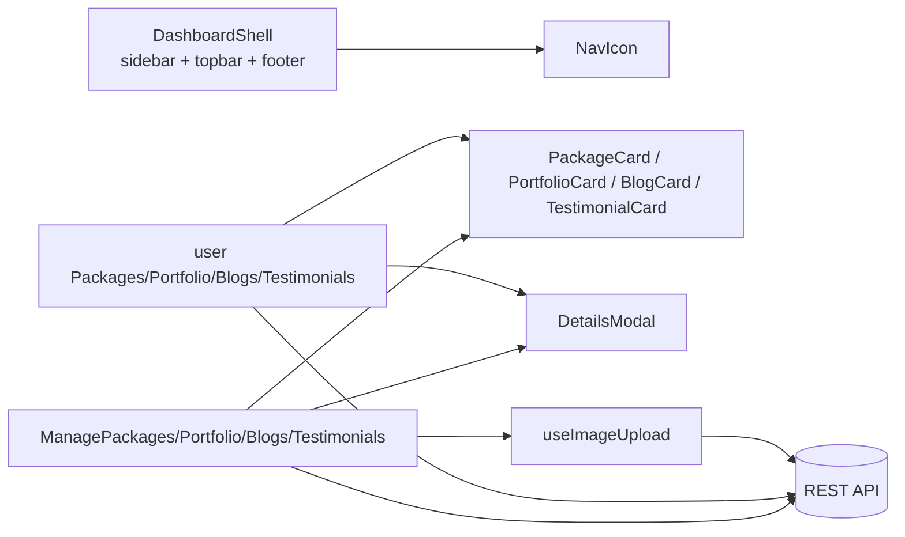
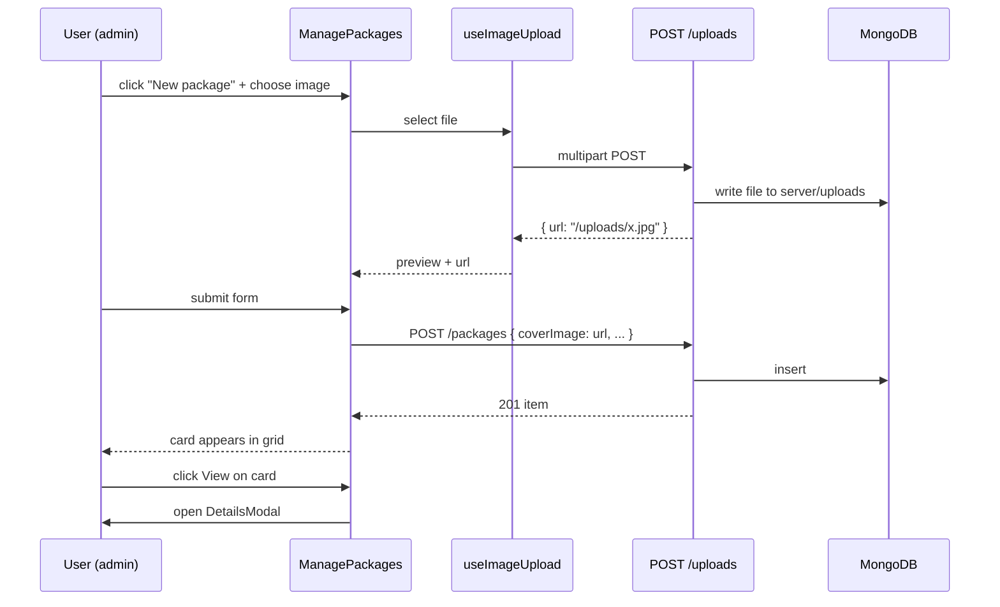
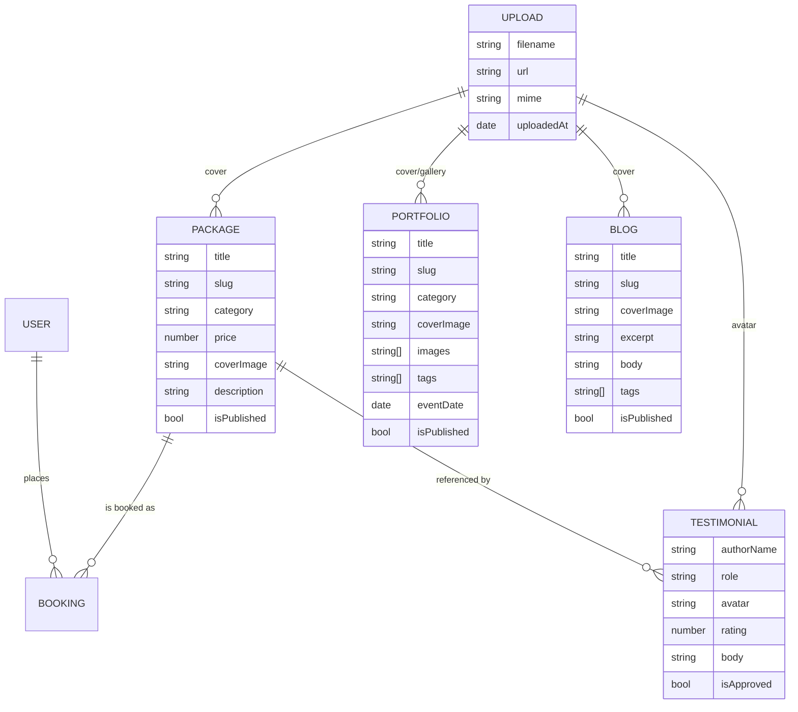

## Plan: Dashboard UI polish and CRUD cards

**TL;DR**
Replace the iconless text sidebar with theme-matched SVG icons + labels (Book Now stays), add a phone icon tile in the Contact us section, restore a slim `© 2026 Chronos Moments. All rights reserved.` footer, and rebuild the four visual admin CRUD pages (Packages, Portfolio, Blogs, Testimonials) as image-upload cards with a shared Details modal. Mirror those four as read-only user-facing card views so the user role has browse access but no edit/delete.

**Steps**

1. **Build a shared `NavIcon` component**
   - File: `client/src/components/NavIcon.jsx`.
   - One tiny inline-SVG icon set, one `<NavIcon name="home" | "services" | "portfolio" | "packages" | "about" | "blogs" | "bookings" | "admin" | "packages-admin" | "users" | "testimonials" />` component.
   - Stroke uses `currentColor` so `text-brand` / `text-ink` theming works automatically. Default 20×20, className-overridable.

2. **Redesign `DashboardShell` sidebar + footer**
   - File: `client/src/components/DashboardShell.jsx`.
   - Add an `Icon` key to each `userNav` / `adminNav` entry; render a left `<NavIcon>` next to the label inside `NavItem`.
   - Active state keeps the brand color; inactive uses `text-ink/80` → `hover:text-ink`.
   - Sidebar root: keep `bg-lav-100/70` panel, white main column.
   - Topbar text: `Book Now`, `Logout`, search input, and the dynamic `title` prop stay (per earlier fix).
   - **Phone tile in Contact us**: add a second NavLink to `${base}/contact` rendering a small phone SVG (`<path d="M3 5c0-1 1-2 2-2h2l2 5-2 1a12 12 0 0 0 6 6l1-2 5 2v2c0 1-1 2-2 2A18 18 0 0 1 3 5Z"/>`) with a "Call us" tooltip — clicking it triggers `window.location.href = "tel:+8801700000000"` (placeholder number pulled from README seed).
   - **Footer**: re-add a single-line footer pinned to the bottom of the main column: `© 2026 Chronos Moments. All rights reserved.` styled `text-xs text-ink-muted border-t border-lav-200 bg-white px-6 py-3`.

3. **Add a shared `useImageUpload` hook**
   - File: `client/src/lib/useImageUpload.js`.
   - Returns `{ inputProps, preview, error, reset, fileName }`.
   - Accepts a single file → `FileReader.readAsDataURL` for preview → POSTs to `POST /uploads` (multipart) → returns `{ url }` from the server. Falls back to data-URL if the upload route is not present.
   - Reason: gives every form the same "drag or click to upload" UX, replaces raw URL inputs.

4. **Backend: image upload endpoint (if missing)**
   - Files: `server/src/routes/uploadRoutes.js`, `server/src/index.js` (or wherever routes are mounted), `server/src/middleware/upload.js`.
   - Use `multer` with disk storage to `server/uploads/`, serve statically at `/uploads`, return `{ url: "/uploads/<filename>" }`.
   - Auth: `protect` only — admins upload from the dashboard; user portal does not need it.
   - If `multer` is already wired, skip and just verify.

5. **Shared `DetailsModal` component**
   - File: `client/src/components/DetailsModal.jsx`.
   - Props: `open`, `onClose`, `title`, `image`, `meta` (array of `{label, value}`), `body`, `actions` (optional ReactNode).
   - Backdrop click + Esc close. Uses existing brand tokens. Read-only — no edit affordance.

6. **Rebuild `ManagePackages.jsx` as cards**
   - Replace the table + side form with a 3-column responsive grid of cards.
   - Each card: cover image (with fallback gradient), title, price (BDT), category pill, "View" / "Edit" / "Delete" icon buttons.
   - "View" opens `DetailsModal` with full description and the package price breakdown.
   - Right rail keeps the create/edit form (title, category, price, description, cover upload via `useImageUpload`, isPublished). Submit hits existing `POST /packages` / `PUT /packages/:id`.

7. **Rebuild `ManagePortfolio.jsx` as cards** *(depends on 3, 5)*
   - Card grid: cover image, title, category pill, event date, published toggle, View / Edit / Delete.
   - "View" opens `DetailsModal` with cover, gallery thumbnails, description, tags, location, event date.
   - Form panel adds cover + gallery uploads (`useImageUpload` for cover, multi-upload for gallery, appends URLs newline-separated).

8. **Rebuild `ManageBlogs.jsx` as cards** *(depends on 3, 5)*
   - Card grid: cover image, title, excerpt (line-clamp-2), published pill, author + date meta, View / Edit / Delete.
   - "View" opens `DetailsModal` rendering the markdown-style body as plain text (escape HTML), cover, tags.

9. **Rebuild `ManageTestimonials.jsx` as cards** *(depends on 5)*
   - Card grid: avatar (or initials fallback), authorName, role, star rating, body (line-clamp-3), approved pill, View / Edit / Delete.
   - "View" opens `DetailsModal` with full body, package reference, created date, approve toggle.

10. **User-facing read-only card views**
    - Files: `client/src/pages/user/Packages.jsx` (replace existing list), new `client/src/pages/user/Portfolio.jsx`, new `client/src/pages/user/Blogs.jsx`, new `client/src/pages/user/Testimonials.jsx` (or fold into existing placeholders).
    - Each uses the same card component as the admin page (extract `PackageCard`, `PortfolioCard`, `BlogCard`, `TestimonialCard` into `client/src/components/cards/`) with **no action buttons**, and clicking a card opens `DetailsModal` for full content.
    - Wire routes in `client/src/App.jsx`: `/dashboard/portfolio`, `/dashboard/blogs`, `/dashboard/testimonials` (public to logged-in users; admin can still navigate via `/admin/*`).

11. **Sidebar nav update for users**
    - Replace the `Portfolio` / `Blogs` SimplePage stubs with real routes.
    - Remove `Services` and `About us` if they remain placeholders, or keep pointing to `SimplePage` for now. Recommendation: keep `Services` / `About` as `SimplePage` stubs (matches "coming soon" pattern).

12. **Verify**
    - `cd client && npm run build` — must remain green.
    - `cd server && npm run dev` (manual) — sign in as admin, create one item per page, upload an image, click View, confirm Details modal renders image + meta + body, then delete it.
    - Sign in as user, confirm same card views render read-only with no action buttons, click View modal works.
    - Mobile breakpoint: sidebar collapses (existing behaviour), footer remains visible.

**Relevant files**
- `client/src/components/DashboardShell.jsx` — sidebar icons, phone tile, footer.
- `client/src/components/NavIcon.jsx` — new shared icon set.
- `client/src/components/DetailsModal.jsx` — new shared read-only viewer.
- `client/src/lib/useImageUpload.js` — new upload hook.
- `client/src/components/cards/{PackageCard,PortfolioCard,BlogCard,TestimonialCard}.jsx` — new shared card atoms.
- `client/src/pages/admin/ManagePackages.jsx` — rebuild as cards.
- `client/src/pages/admin/ManagePortfolio.jsx` — rebuild as cards.
- `client/src/pages/admin/ManageBlogs.jsx` — rebuild as cards.
- `client/src/pages/admin/ManageTestimonials.jsx` — rebuild as cards.
- `client/src/pages/user/Packages.jsx` — read-only cards.
- `client/src/pages/user/Portfolio.jsx` — new read-only page.
- `client/src/pages/user/Blogs.jsx` — new read-only page.
- `client/src/pages/user/Testimonials.jsx` — new read-only page.
- `client/src/App.jsx` — wire new user routes.
- `server/src/routes/uploadRoutes.js` + `server/src/middleware/upload.js` + `server/src/index.js` — image upload endpoint (only if not present).
- `client/tailwind.config.js` / `client/src/index.css` — extend with `.card`, `.btn-ghost`, `.btn-danger` utilities if not already defined.

**Diagrams**

**Verification**
1. `npm run build` (client) succeeds.
2. Sign in as admin: Packages / Portfolio / Blogs / Testimonials pages render as image cards; create + upload image + edit + delete all work; View opens `DetailsModal` with full content.
3. Sign in as user: same four pages render as cards with **no** Edit/Delete buttons; View modal works.
4. Sidebar shows icons + labels on both variants; Contact us section has the phone tile alongside the existing message tile; clicking the phone tile opens the dialer.
5. Footer `© 2026 Chronos Moments. All rights reserved.` is visible at the bottom of every dashboard page (both variants).
6. No emoji glyphs anywhere in `client/src/**` (regex sweep should still return no matches).
