# Chronos Moments — BiyeBuzz.com

> **Capturing Timeless Memories, Preserving Every Moment.**
>
> A wedding photography & cinematography platform with portfolio, blog, packages, online booking, an admin console, and automated email notifications.

This monorepo contains two applications that ship together:

| Folder | Stack | Purpose |
|---|---|---|
| [`server/`](./server) | Node.js · Express · MongoDB (Mongoose) · JWT · Nodemailer | REST API, authentication, content management, booking lifecycle |
| [`client/`](./client) | React · Vite · Tailwind CSS · Axios · React Router | Public marketing/portfolio SPA + admin console |

---

## Table of Contents

1. [High-Level Architecture](#1-high-level-architecture)
2. [How the Database Is Created by Mongoose](#2-how-the-database-is-created-by-mongoose)
3. [Authentication & Authorization](#3-authentication--authorization)
4. [Email Sending Flow](#4-email-sending-flow)
5. [Booking Flow (User)](#5-booking-flow-user)
6. [Booking Management (Admin)](#6-booking-management-admin)
7. [Content Management (Admin CRUD)](#7-content-management-admin-crud)
8. [Dashboard](#8-dashboard)
9. [Public Read APIs (Portfolio)](#9-public-read-apis-portfolio)
10. [Track Booking](#10-track-booking)
11. [Admin Self-Management](#11-admin-self-management)
12. [Seed / Bootstrap](#12-seed--bootstrap)
13. [Prerequisites & Setup](#13-prerequisites--setup)
14. [Environment Variables](#14-environment-variables)
15. [Brand Tokens](#15-brand-tokens)
16. [Project Structure](#16-project-structure)
17. [Tech Stack](#17-tech-stack)

---

## 1. High-Level Architecture

The system is a classic three-tier monorepo: **Browser → Express API → MongoDB**, with an SMTP provider used for transactional email.

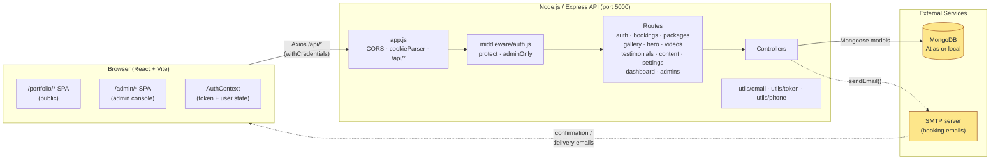

### Why two collections for accounts?

`User` (customers / front-end users) and `Admin` (operators) live in **separate collections** so an `_id` collision can never give a customer admin power, and so admin credentials are isolated from the customer surface area. The JWT carries a `role` claim; the auth middleware checks the right collection first.

### Why two client SPAs?

`client/src/App.jsx` (root React Router) mounts **two parallel sub-apps** at different URL prefixes:

- `/portfolio/*` — public marketing/portfolio SPA (`PortfolioApp`).
- `/admin/*` — admin console (the root `App.jsx` routes).

This keeps the admin bundle, styling, and routing completely separate from the public site.

---

## 2. How the Database Is Created by Mongoose

### 2.1 The bootstrap moment

When `npm run dev` starts the server, `src/server.js` runs an `async` IIFE that calls `connectDB()` **before** `app.listen()`:

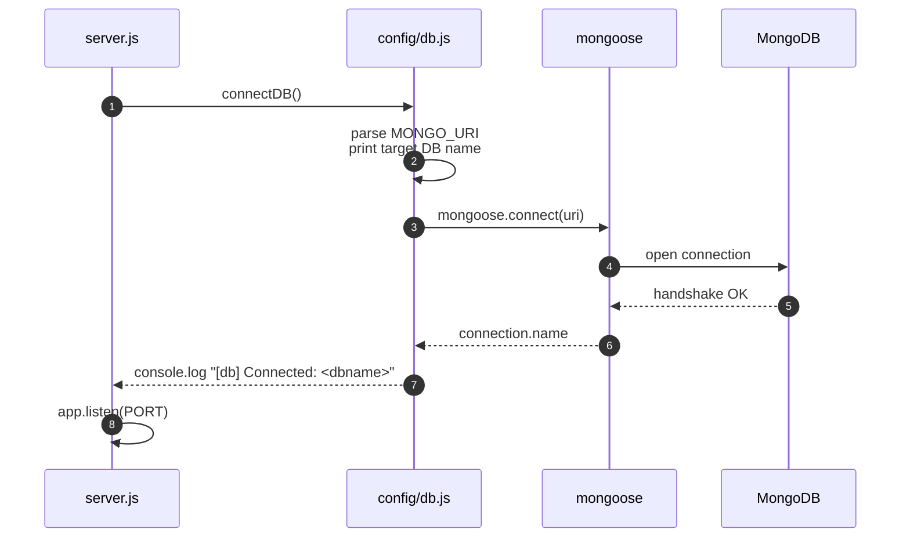

Key points:
- The database name comes from the **path segment of `MONGO_URI`** (e.g. `…/chronos_moments` → DB `chronos_moments`). The parser logs the resolved name so a missing `/<dbname>` is obvious in boot logs.
- `mongoose.set('strictQuery', true)` is set for forward-compat.
- If `MONGO_URI` is missing or the connection fails, the server **exits with code 1** — no half-running API.

### 2.2 How collections appear (lazy on first use)

Mongoose does **not** create collections at connection time. A collection is created the first time a model is used to write data. The seeder (`npm run seed`) deliberately writes to every collection so a fresh deployment is fully provisioned.

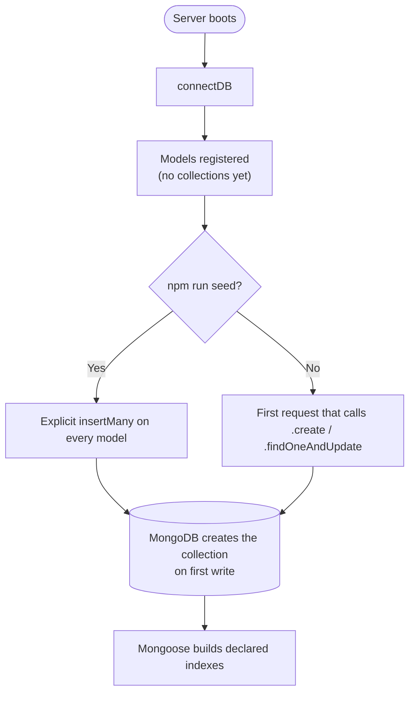

### 2.3 Entity-Relationship Diagram

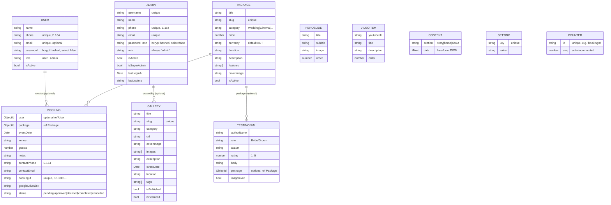

### 2.4 Indexes (declared by Mongoose)

| Model | Index | Purpose |
|---|---|---|
| `User` | `email` unique (partial, only when string) | prevent duplicate emails; allows multiple nulls |
| `User` | `phone` unique (partial) | E.164 phone is the login key |
| `Admin` | `email` unique (partial) | unique admin emails |
| `Admin` | `phone` unique (partial) | unique admin phones |
| `Admin` | `createdAt` desc | sort newest first |
| `Package` | `slug` unique | friendly URLs |
| `Gallery` | `category, isPublished, eventDate` desc | fast public listing |
| `Testimonial` | `isApproved, createdAt` desc | fast public approved listing |
| `Counter` | `id` unique | atomic ID generator |
| `Setting` | `key` unique | upsert by key |
| `Booking` | `bookingId` unique | public lookup |
| `Content` | `section` (queried, not explicitly indexed in code) | section filter |

> **Partial unique indexes** are the trick that lets multiple users have no email without throwing duplicate-key errors on `null`.

---

## 3. Authentication & Authorization

### 3.1 Two parallel account systems

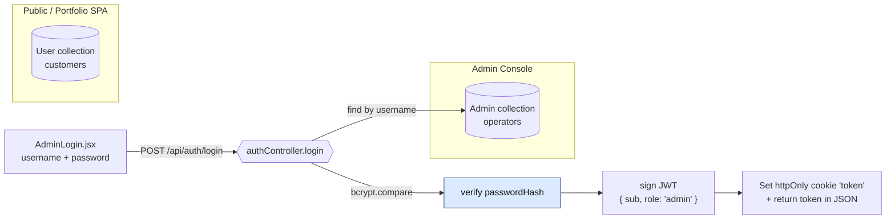

The endpoint is the same `/api/auth/login`, but the controller knows to look in the `Admin` collection. (`User` registration is wired in `AuthContext.register()` but currently has no UI page — login is via the dedicated `/admin/login` screen.)

### 3.2 Login sequence

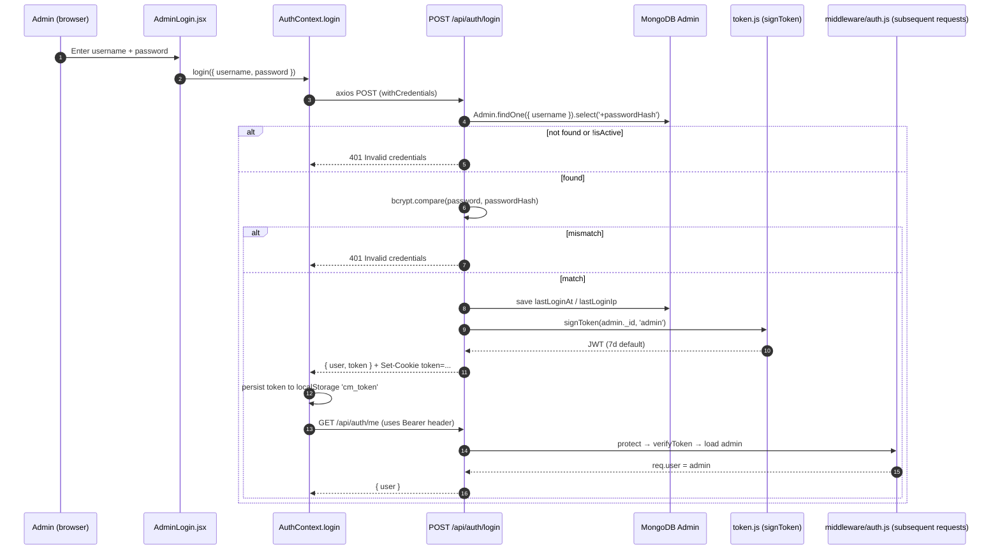

### 3.3 How a protected request is validated

`middleware/auth.js` exports `protect`, `optionalProtect`, `requireRole`, and a combined `adminOnly = [protect, requireRole('admin')]`.

```mermaid
sequenceDiagram
    autonumber
    participant C as Client (axios)
    participant API as Express
    participant P as protect()
    participant V as verifyToken()
    participant M as Mongoose
    participant R as requireRole('admin')

    C->>API: Request with<br/>Authorization: Bearer <jwt><br/>OR Cookie: token=<jwt>
    API->>P: protect()
    P->>V: jwt.verify(token, JWT_SECRET)
    alt invalid/expired
        V-->>P: throws
        P-->>C: 401 Not authenticated
    else valid
        V-->>P: payload { sub, role }
        P->>M: Admin.findById(sub)  [or User if role='user']
        alt not found OR !isActive
            P-->>C: 401 Not authenticated
        else found
            M-->>P: account
            P->>API: req.user = account; next()
        end
    end

    alt adminOnly route
        API->>R: requireRole('admin')
        alt req.user.role !== 'admin'
            R-->>C: 403 Forbidden: insufficient role
        else allowed
            R->>API: next()
            API-->>C: controller response
        end
    else regular user route
        API-->>C: controller response
    end
```

### 3.4 Cookie + Bearer header dual support

The browser always sends the `httpOnly` `token` cookie, and the Axios interceptor also attaches a `Bearer` header from `localStorage`. Either alone is enough — `protect()` tries `Authorization` first, then `req.cookies.token`. This means:

- Cookie alone → safe for SSR / first paint.
- Bearer alone → safe for non-browser clients / Postman.
- Both present → `Authorization` wins.

### 3.5 Logout

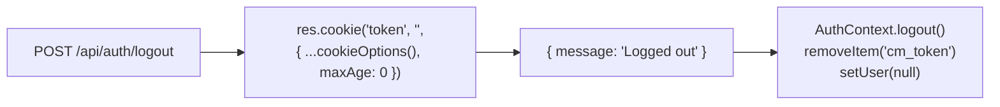

---

## 4. Email Sending Flow

The server uses `nodemailer` with a transporter created at boot from SMTP env vars. If any SMTP credential is missing, emails fall back to a **console logger** (so dev still works).

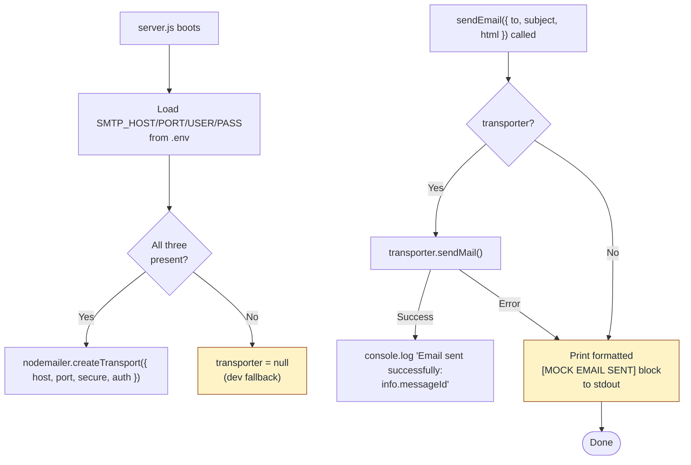

### 4.1 The two real email triggers today

```mermaid
sequenceDiagram
    autonumber
    participant Adm as Admin
    participant API as PATCH /api/bookings/:id
    participant BC as bookingController.adminUpdateBooking
    participant DB as MongoDB
    participant EM as utils/email.sendEmail
    participant SMTP as SMTP server
    participant C as Customer inbox

    Adm->>API: { status: 'approved' }
    API->>DB: Booking.findById(id).populate('package')
    DB-->>API: booking
    API->>API: b.status = 'approved'; b.save()
    alt oldStatus !== 'approved' AND b.contactEmail present
        API->>EM: sendEmail({ to: contactEmail, subject: 'Booking Confirmed!...', html: ... })
        EM->>SMTP: sendMail(...)
        SMTP-->>C: "Booking Confirmed 🎉" + table
        SMTP-->>EM: info.messageId
        EM-->>API: log success
    end
    API-->>Adm: updated booking JSON

    Note over Adm,C: The same flow fires when status changes to 'completed':<br/>email contains the Google Drive delivery link.
```

| Trigger | Subject | Body contains |
|---|---|---|
| `status` changes from anything → `approved` | `Booking Confirmed! - Reference: <bookingId>` | Hero, formatted event date, package title, venue, **Track Booking** link |
| `status` changes from anything → `completed` | `Your Photos/Videos are Ready! - Reference: <bookingId>` | Hero, **Google Drive link button**, booking ID, track link |

Both emails render in a styled `<table>` with the brand gold underline (`#D4AF37`) and link back to `${CLIENT_ORIGIN}/track-booking`.

---

## 5. Booking Flow (User)

The user can be **logged in or anonymous** (`optionalProtect` lets the booking carry their `user` reference if a session exists).

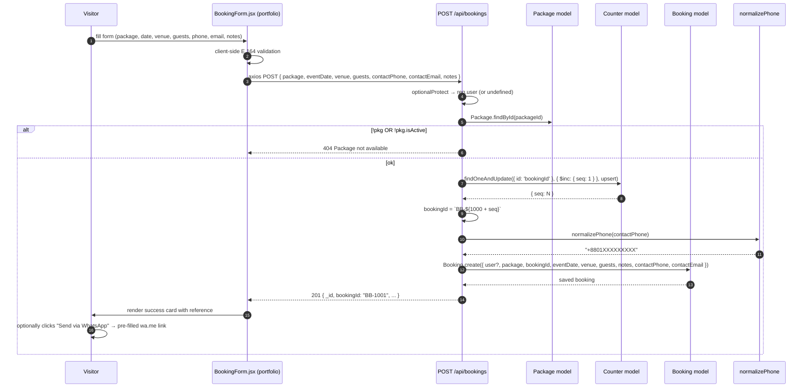

### 5.1 `bookingId` is generated atomically

`Counter` is a tiny collection used as an atomic sequence. `findOneAndUpdate({ id: 'bookingId' }, { $inc: { seq: 1 } }, { upsert: true, new: true })` is the only safe way in MongoDB to "increment and return the next number". The displayed ID becomes `BB-${1000 + seq}`, so the first booking ever is `BB-1001`.

### 5.2 Phone normalization

`utils/phone.js` accepts any of these inputs and emits `+8801XXXXXXXXX`:

| Input | Normalized |
|---|---|
| `01712345678` | `+8801712345678` |
| `+8801712345678` | `+8801712345678` |
| `8801712345678` | `+8801712345678` |
| `008801712345678` | `+8801712345678` |
| `1712345678` (US) | `+11712345678` |

---

## 6. Booking Management (Admin)

Admin list + status update is the heart of the operator workflow.

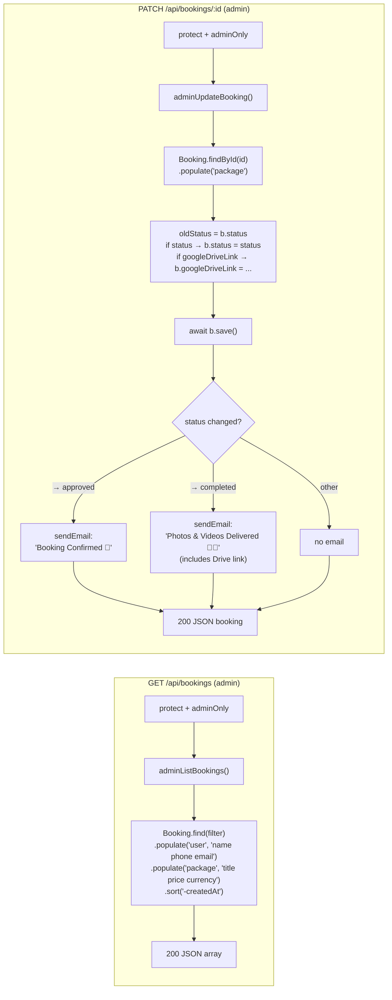

---

## 7. Content Management (Admin CRUD)

Every content resource follows the same shape: **public list → admin list → admin CRUD**. Routes guard admin routes with `protect + adminOnly`.

### 7.1 Hero Slides

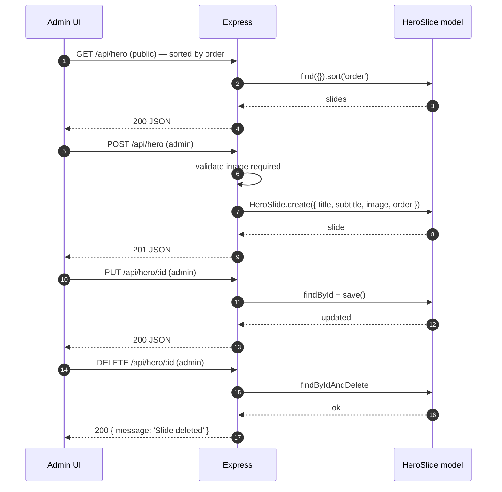

### 7.2 Videos (YouTube)

Same shape as hero slides. Each item stores `youtubeUrl`, optional `title` / `description`, and a numeric `order`.

### 7.3 Packages

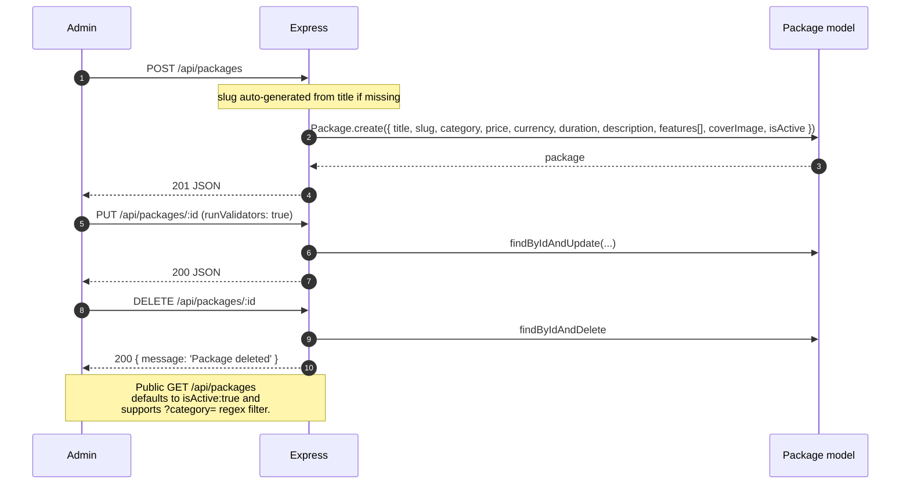

`category` is an enum: `Wedding | Cinematography | Pre-Wedding | Engagement | Event | Custom | Holud`. The public list filter uses a case-insensitive regex match on category.

### 7.4 Gallery (Portfolio)

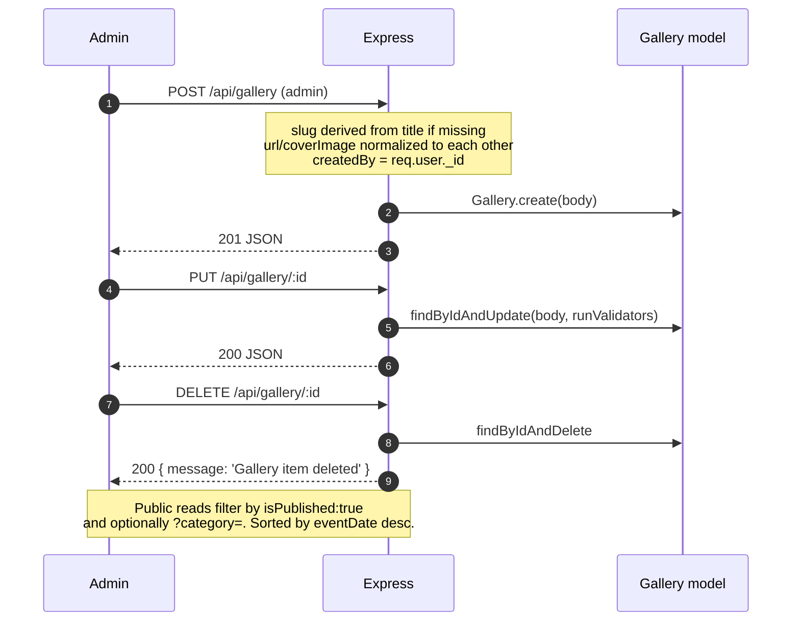

### 7.5 Testimonials

Public listing filters `isApproved: true`. Admin CRUD bypasses that filter so the operator can review pending reviews.

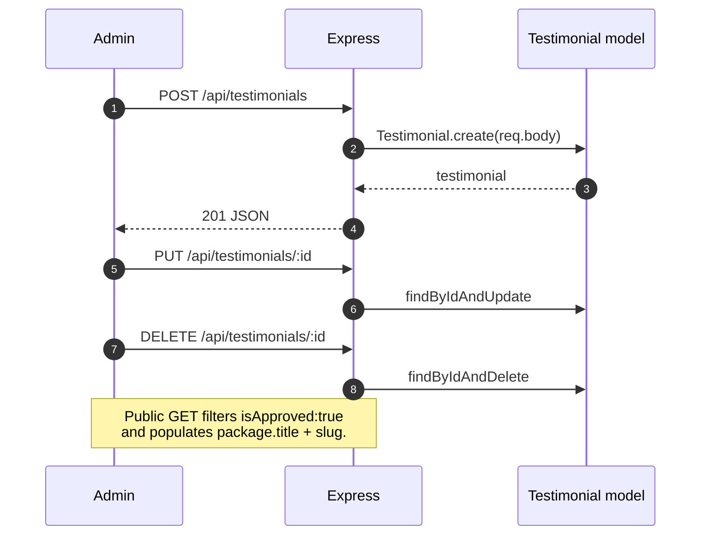

### 7.6 Content (Home / About / Story)

`Content` is a flexible JSON document per section. `home` and `about` are **single documents** (upserted); `story` is a **collection of items** ordered by `data.order`.

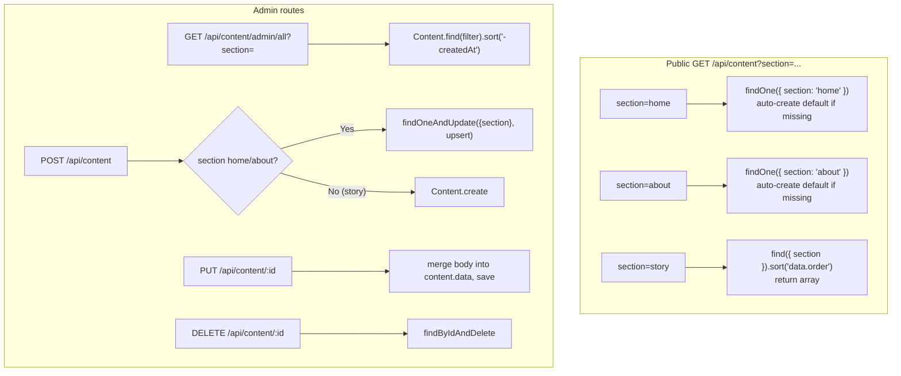

### 7.7 Settings

Simple key-value store. The seeder seeds common keys (`whatsapp_number`, `contact_email`, `contact_phone`, `contact_address`, social URLs).

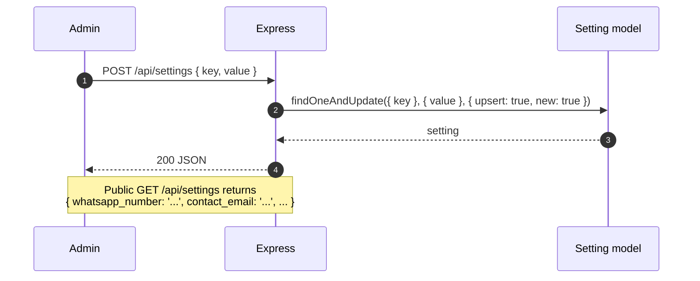

---

## 8. Dashboard

A tiny aggregation endpoint that powers the admin home cards.

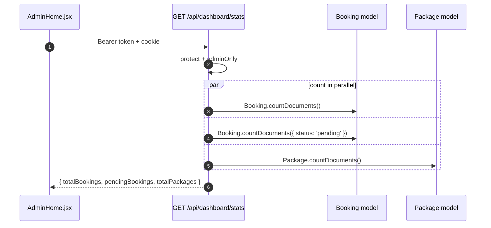

---

## 9. Public Read APIs (Portfolio)

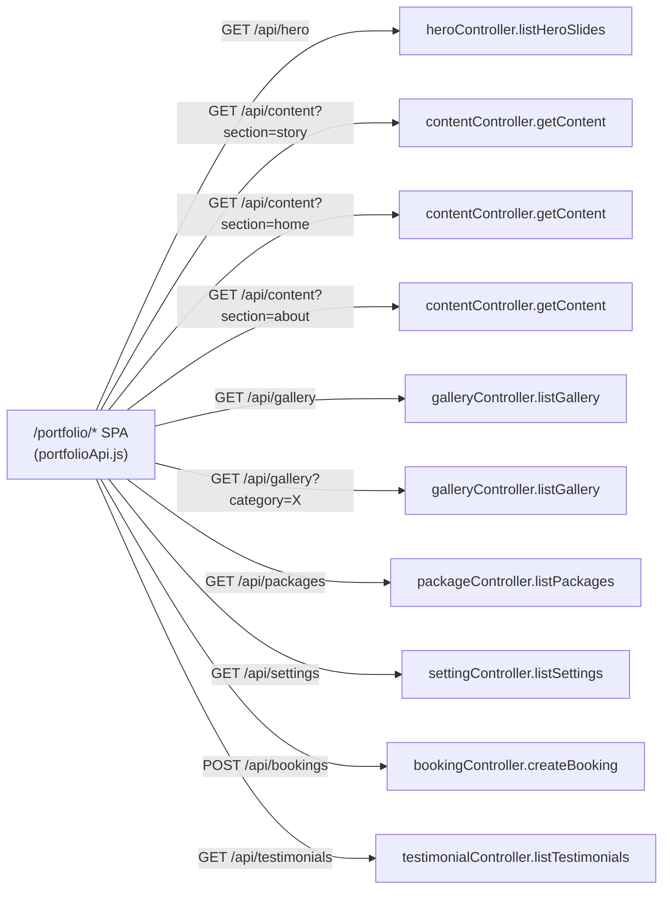

The `portfolioApi.js` mapper translates the public SPA's expectations onto the actual REST surface and ships curated fallback data for `/api/services` and team bios so the SPA always renders even before content is seeded.

---

## 10. Track Booking

Anonymous lookup so customers can find their own booking without logging in.

```mermaid
sequenceDiagram
    autonumber
    participant U as Visitor
    participant Page as TrackBooking.jsx
    participant API as GET /api/bookings/track
    participant N as normalizePhone
    participant DB as MongoDB
    U->>Page: enter Booking ID + Phone
    Page->>API: ?bookingId=BB-1001&phone=017...
    API->>N: normalizePhone(phone)
    N-->>API: "+8801XXXXXXXXX"
    API->>DB: Booking.findOne({ bookingId: BB-1001, contactPhone: +8801... }).populate('package','title price currency')
    alt not found
        API-->>Page: 404 Booking not found with the provided ID and phone number
    else found
        API-->>Page: booking JSON
        Page->>U: render status, date, venue, package
    end
```

This is the **only** way to reveal a booking to a non-logged-in user — it requires both the `bookingId` (printed in the confirmation email / WhatsApp message) **and** the contact phone, so it cannot be a free search.

---

## 11. Admin Self-Management

Admins can edit other admins and rotate their own password through `/api/admins`.

```mermaid
flowchart TB
    subgraph ListAll["Super-admin only"]
        L1["GET /api/admins"] --> L2["adminController.listAdmins<br/>(optional impl)"]
    end

    subgraph UpdateAdmin["PATCH /api/admins/:id"]
        U0["protect + adminOnly"] --> U1["adminController.updateAdmin"]
        U1 --> U2["filter allowed fields:<br/>username, name, email, phone, isActive, isSuperAdmin, role"]
        U2 --> U3{isSuperAdmin→false<br/>OR isActive→false?}
        U3 -- "Yes" --> U4["countDocuments({ isSuperAdmin:true, isActive:true, _id:{$ne:target} })"]
        U4 -- "remaining === 0" --> U5["400 Cannot deactivate the last active super admin"]
        U4 -- "remaining > 0" --> U6["Admin.findByIdAndUpdate(updates, runValidators:true)"]
        U3 -- "No" --> U6
        U6 --> U7["200 updated admin"]
    end

    subgraph ChangePassword["POST /api/admins/:id/change-password"]
        C0["protect + adminOnly"] --> C1["adminController.changePassword"]
        C1 --> C2["{ currentPassword, newPassword } required"]
        C2 --> C3["Admin.findById(id).select('+passwordHash')"]
        C3 --> C4["admin.comparePassword(currentPassword)"]
        C4 -- "mismatch" --> C5["401 Current password is incorrect"]
        C4 -- "match" --> C6["admin.passwordHash = newPassword<br/>await admin.save()<br/>(pre-save hook hashes it)"]
        C6 --> C7["200 { message: 'Password updated' }"]
    end
```

Two safeguards worth highlighting:

1. The **last active super admin cannot be demoted or deactivated** — the controller counts remaining super admins first and returns 400 otherwise.
2. Passwords are always routed through `passwordHash` and the model's `pre('save')` hook so they're bcrypt-hashed exactly once.

---

## 12. Seed / Bootstrap

`npm run seed` runs `scripts/seedAdmin.js`, which is **idempotent** — safe to run on every deploy.

```mermaid
flowchart TB
    Seed(["npm run seed"]) --> Conn[connectDB]
    Conn --> FindAdmin["Admin.findOne({ $or: [username, email] })"]
    FindAdmin -- "found" --> Patch["Update name/email/phone/username<br/>if any drift; force isActive=true and isSuperAdmin=true"]
    FindAdmin -- "missing" --> Create["Admin.create({ username, passwordHash, name, email, phone, role:'admin', isSuperAdmin:true })<br/>(pre-save hook hashes the password)"]
    Patch --> Settings
    Create --> Settings["Upsert default settings<br/>(whatsapp_number, contact_email, socials, address)"]
    Settings --> S1{slideCount === 0?}
    S1 -- "Yes" --> S2["Seed 3 default HeroSlides"]
    S1 -- "No" --> S3
    S2 --> S3{storyCount === 0?}
    S3 -- "Yes" --> S4["Seed default Content (story)"]
    S3 -- "No" --> S5
    S4 --> S5{videoCount === 0?}
    S5 -- "Yes" --> S6["Seed 3 default YouTube VideoItems"]
    S5 -- "No" --> S7
    S6 --> S7{packageCount === 0?}
    S7 -- "Yes" --> S8["Seed Standard / Premium / Signature packages"]
    S7 -- "No" --> S9
    S8 --> S9{galleryCount === 0?}
    S9 -- "Yes" --> S10["Seed 3 sample galleries"]
    S9 -- "No" --> S11
    S10 --> S11{testimonialCount === 0?}
    S11 -- "Yes" --> S12["Seed 2 approved testimonials"]
    S11 -- "No" --> S13
    S12 --> S13{homeContentCount === 0?}
    S13 -- "Yes" --> S14["Seed default Content (home)"]
    S13 -- "No" --> S15
    S14 --> S15{aboutContentCount === 0?}
    S15 -- "Yes" --> S16["Seed default Content (about)"]
    S15 -- "No" --> Done([Print credentials summary])
    S16 --> Done
```

Default seeded credentials (from `seedAdmin.js` and `.env.example`):

| Field | Value |
|---|---|
| Username | `admin` |
| Password | `Admin@12345` |
| Phone | `+8801700000000` |
| Email | `admin@biyebuzz.com` |
| Role | `admin` (super) |
| Sign in at | `http://localhost:5173/admin/login` |

---

## 13. Prerequisites & Setup

### Prerequisites

- Node.js **18+**
- MongoDB running locally on `mongodb://127.0.0.1:27017` **or** a MongoDB Atlas URI
- (Optional) SMTP credentials for transactional email

### Backend

```bash
cd server
cp .env.example .env       # then edit values
npm install
npm run dev                # http://localhost:5000
```

Seed the first admin + default content:

```bash
npm run seed
```

Health check: <http://localhost:5000/api/health>

### Frontend

```bash
cd client
cp .env.example .env       # VITE_API_URL=/api  (default)
npm install
npm run dev                # http://localhost:5173
```

Vite proxies `/api/*` to `http://localhost:5000`, so cookies & same-origin just work in development.

---

## 14. Environment Variables

### `server/.env`

| Key | Required | Purpose |
|---|---|---|
| `PORT` | no (default 5000) | API port |
| `NODE_ENV` | no | `production` flips cookies to `secure` and `sameSite=none` |
| `MONGO_URI` | **yes** | Full MongoDB connection string, including `/<dbname>` |
| `JWT_SECRET` | **yes** | Long random string |
| `JWT_EXPIRES_IN` | no (default `7d`) | Token lifetime |
| `COOKIE_EXPIRES_IN_DAYS` | no (default 7) | Cookie max-age |
| `CLIENT_ORIGIN` | no (default `http://localhost:5173`) | CORS origin + email link base |
| `SMTP_HOST` / `SMTP_PORT` / `SMTP_USER` / `SMTP_PASS` | for email | If any is missing, emails fall back to console logger |
| `EMAIL_FROM` | no | Default `no-reply@biyebuzz.com` |
| `SEED_ADMIN_USERNAME` / `SEED_ADMIN_PASSWORD` / `SEED_ADMIN_NAME` / `SEED_ADMIN_EMAIL` / `SEED_ADMIN_PHONE` | for seeding | Used by `npm run seed` |

### `client/.env`

| Key | Purpose |
|---|---|
| `VITE_API_URL` | Defaults to `/api` (Vite proxy handles the rest) |

---

## 15. Brand Tokens

| Token | Value |
|---|---|
| Primary button | `#D429F3` / `#D4AF37` (gold) |
| Background | `#E6D9E8` (lavender) / `#FDFCF9` (cream) |
| Ink | `#1A1A1A` (charcoal) / `#1F1B20` (ink) |
| Editorial palette | `#F2EBE0` paper · `#0E0D0B` carbon · `#A8541A` sepia |
| Font — body | Poppins / Plus Jakarta Sans / Satoshi |
| Font — wordmark | Great Vibes (cursive) |
| Font — display | Cabinet Grotesk / Fraunces |

---

## 16. Project Structure

```
.
├── server/
│   ├── src/
│   │   ├── server.js              # boot: connectDB → app.listen
│   │   ├── app.js                 # Express app, CORS, /api/* routing
│   │   ├── config/db.js           # Mongoose connect + URI parser
│   │   ├── models/                # 11 Mongoose models
│   │   │   ├── Admin.js           # operators (separate from User)
│   │   │   ├── User.js            # customers (bcrypt, partial unique index)
│   │   │   ├── Booking.js         # bookingId, status, contactPhone (E.164)
│   │   │   ├── Counter.js         # atomic ID generator
│   │   │   ├── Package.js         # wedding packages
│   │   │   ├── Gallery.js         # portfolio albums
│   │   │   ├── HeroSlide.js       # home carousel slides
│   │   │   ├── VideoItem.js       # YouTube embeds
│   │   │   ├── Testimonial.js     # reviews with isApproved
│   │   │   ├── Content.js         # free-form home/about/story
│   │   │   └── Setting.js         # key-value config store
│   │   ├── controllers/           # one per resource
│   │   ├── routes/                # one per resource, mounted in app.js
│   │   ├── middleware/
│   │   │   ├── auth.js            # protect, adminOnly, requireRole
│   │   │   └── error.js           # notFound + errorHandler
│   │   ├── utils/
│   │   │   ├── asyncHandler.js    # async wrapper
│   │   │   ├── email.js           # nodemailer transporter + sendEmail
│   │   │   ├── phone.js           # normalizePhone → E.164
│   │   │   └── token.js           # signToken, verifyToken, cookieOptions
│   │   └── scripts/
│   │       ├── seedAdmin.js       # idempotent admin + content bootstrap
│   │       ├── seedContent.js     # legacy content seeder (Portfolio/Blog)
│   │       ├── fixDuplicateEmail.js
│   │       └── testEmail.js
│   └── .env.example
├── client/
│   ├── src/
│   │   ├── main.jsx               # BrowserRouter + AuthProvider
│   │   ├── App.jsx                # root routes: /, /admin/*, /portfolio/*
│   │   ├── context/AuthContext.jsx
│   │   ├── components/            # Logo, DashboardShell, ProtectedRoute…
│   │   ├── pages/                 # Home, TrackBooking, admin/*
│   │   ├── portfolio/             # PortfolioApp + pages + BookingForm
│   │   └── lib/                   # api.js (Axios), portfolioApi.js (mapper)
│   ├── tailwind.config.js
│   └── vite.config.js             # /api proxy to :5000
└── README.md                      # ← you are here
```

---

## 17. Tech Stack

**Backend**
- Express 4 · Mongoose 8 · MongoDB 6+
- `jsonwebtoken` for stateless auth (with `httpOnly` cookie + Bearer fallback)
- `bcryptjs` for password hashing
- `nodemailer` for transactional email
- `cookie-parser`, `cors`, `express-async-handler`, `dotenv`

**Frontend**
- React 18 · Vite 5 · React Router 6
- Axios with `withCredentials` + request/response interceptors
- Tailwind CSS 3 with custom design tokens (cream, charcoal, gold, lavender, paper, carbon, sepia)
- `lucide-react` icons

**Tooling**
- `nodemon` for backend dev hot-reload
- Idempotent seeder for safe re-deploys
- AI Agent Integration: Workspace workflows (`.agent`), agent skills (`.agents`), and execution context/databases (`.puku`, `.puku-cli`, `.gemini`, `.gsd`, `.opencode` — all ignored in Git)

---

## Quick Reference: All REST Endpoints

### Public

| Method | Path | Description |
|---|---|---|
| GET | `/api/health` | Liveness probe |
| POST | `/api/auth/login` | Admin login (username + password) |
| POST | `/api/auth/logout` | Clear auth cookie |
| GET | `/api/auth/me` | Current account (cookie or Bearer) |
| GET | `/api/packages` | List active packages, filter by `?category=` |
| GET | `/api/packages/:id` | Single package |
| GET | `/api/gallery` | Published gallery, filter `?category=` |
| GET | `/api/gallery/:id` | Single gallery item |
| GET | `/api/testimonials` | Approved testimonials |
| GET | `/api/hero` | Hero slides, ordered |
| GET | `/api/videos` | YouTube videos, ordered |
| GET | `/api/settings` | All settings as `{ key: value }` |
| GET | `/api/content?section=home\|about\|story` | Free-form content |
| POST | `/api/bookings` | Create booking (optional auth) |
| GET | `/api/bookings/track` | Lookup by `bookingId` + `phone` |

### Admin only (`protect + adminOnly`)

| Method | Path | Description |
|---|---|---|
| GET | `/api/bookings` | List all bookings, filter `?status=` |
| PATCH | `/api/bookings/:id` | Update status + Google Drive link → triggers email |
| GET | `/api/dashboard/stats` | Counts for dashboard cards |
| GET / POST | `/api/packages` | List all (admin) / create |
| PUT / DELETE | `/api/packages/:id` | Update / delete |
| GET / POST | `/api/gallery` | List all / create |
| PUT / DELETE | `/api/gallery/:id` | Update / delete |
| GET / POST | `/api/testimonials` | List all / create |
| PUT / DELETE | `/api/testimonials/:id` | Update / delete |
| GET / POST | `/api/hero` | List all / create |
| PUT / DELETE | `/api/hero/:id` | Update / delete |
| GET / POST | `/api/videos` | List all / create |
| PUT / DELETE | `/api/videos/:id` | Update / delete |
| POST | `/api/settings` | Upsert setting by key |
| GET / POST | `/api/content` | List by section / create or upsert |
| PUT / DELETE | `/api/content/:id` | Update / delete |
| PATCH | `/api/admins/:id` | Update admin (safe super-admin guard) |
| POST | `/api/admins/:id/change-password` | Rotate admin password |

---

> Made with care by the Chronos Moments team — *Turning your forever moments into timeless memories.*
<!-- puku-cli --resume d08c58cb-6300-4014-9e0f-a95769832e8a -->